# Corneal Boundaries Extraction with U-Net

+ This project works on extracting corneal boundaries with deep learning, precisely, based on the **U-Net** networks. 
+ Better usability thanks to the handsome web **GUI**.
+ Accelerated by GPU (CUDA).

## Getting Started

### Prerequisites
    
+ **Python 3**

+ **PyTorch**, see offical [instructions](http://pytorch.org/).

### Installing

1. Clone this repository

    **Note**: Currently only support Python 3+
    ```bash
    cd /path/to/anywhere/you/like
    git clone https://github.com/zengyu714/corneal-gui
    ```
2. Download the pre-trained weights
    
    ```bash
    cd corneal-gui/unet
    wget -c --referer=https://pan.baidu.com/s/1qYn3JbQ -O corneal-weights.zip "https://www.baidupcs.com/rest/2.0/pcs/file?method=batchdownload&app_id=250528&zipcontent=%7B%22fs_id%22%3A%5B%22747895932828831%22%5D%7D&sign=DCb740ccc5511e5e8fedcff06b081203:ZFmUVd4WUFSnu7qfoVgD0wczdaY%3D&uid=2265930192&time=1513187178&dp-logid=8026429103670053409&dp-callid=0&vuk=2265930192&from_uk=2265930192"
    unzip corneal-weights.zip 
    mv corneal-gui-weights weights
    rm -rf corneal-*
    ```
    
3. Install requirements
    ```bash
    # may activate your virtual environment first
    sudo pip install -r /path/to/corneal-gui/requirements.txt
    ```

4. Fire the web server

    ```bash
    cd /path/to/corneal-gui
    python gui.py runserver
    
    # or specify the host and port, default is http://localhost:5001
    # python gui.py runserver --host X.X.X.X -p XXXX
    ```
    
5. Navigate to [http://localhost:5001](http://localhost:5001) and you would see:
    
    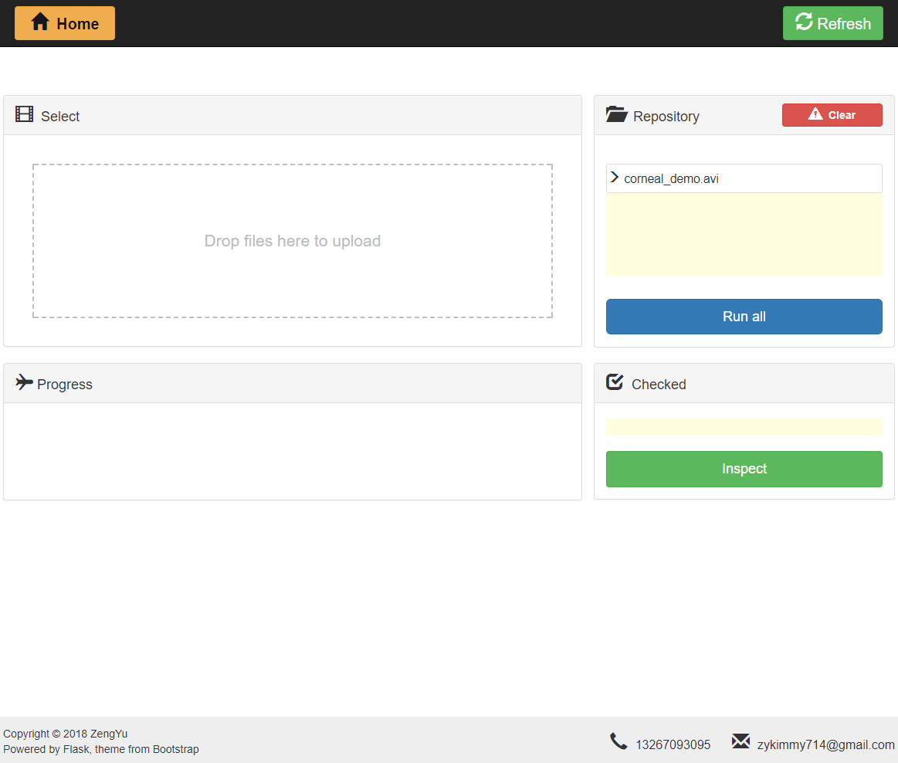

## Running the demo

1. When you see the videos listed in the *Repository*, click the button `Run all`.

    **Note**: Make sure the button is actually responseded by checking the browser status:
    
    
2. Wait a minute (around 8 seconds for a video consisting 139 frames). Alternatively, you could watch the detailed process in the console.

    > **TODO**: display the console output in a real-time way, maybe `Response`.
    
    Anyway, the page would show the output and errors (if any) in the end:
    
    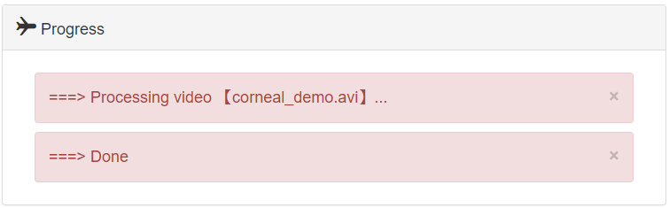

3. Then click and select the video you want to inspect, this checked video name would be shown in the `Checked` panel:

    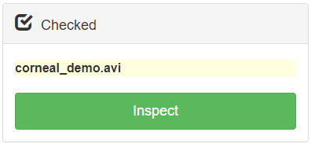

4. Click `Inspect` button and a new tab would be opened:

    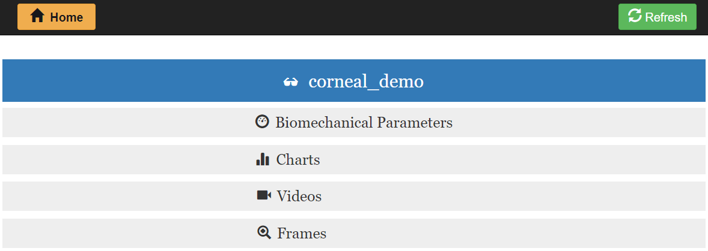
    

### Inspection    

+ Biomechanical Parameters

    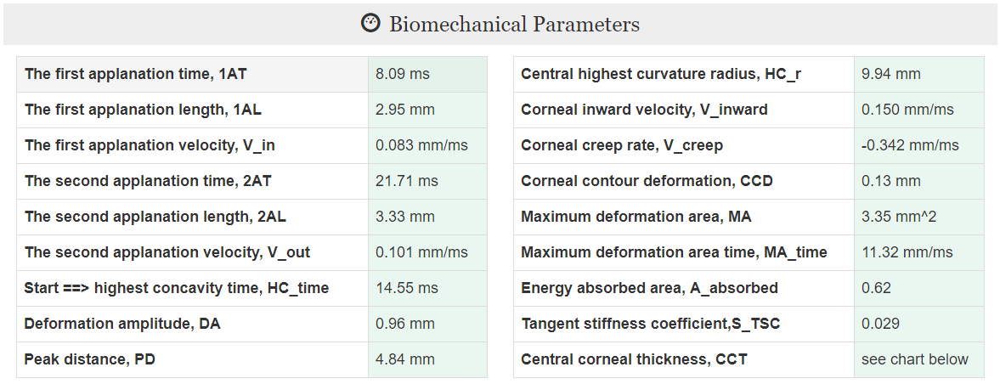
    
    Further explanation of these parameters could be found [here](https://www.nature.com/articles/srep40798.pdf?origin=ppub).

+ Charts

    1. **line chart**: `curvature` and `thickness` of the central corneal area through the whole video.
    
        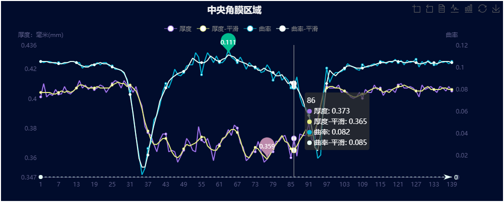
        
    2. **3D scatter**: depicts the **upper** corneal surface.
        
        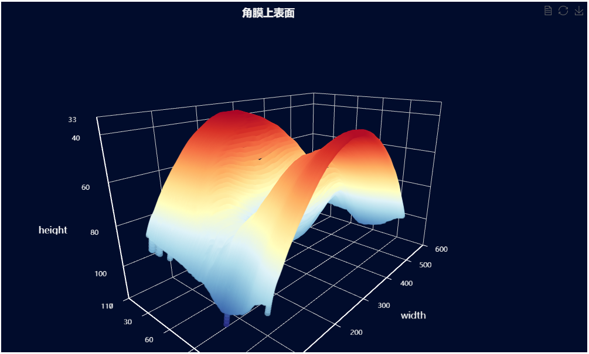
        
    Thanks to the **WONDERFUL** [ECharts](http://echarts.baidu.com/index.html), we could manipulate these drawings, say, `zoom-in/out`, `view original data`, `save figures` by [toolbox](https://ecomfe.github.io/echarts-doc/public/en/option.html#toolbox): 
    
    .  

+ Videos

    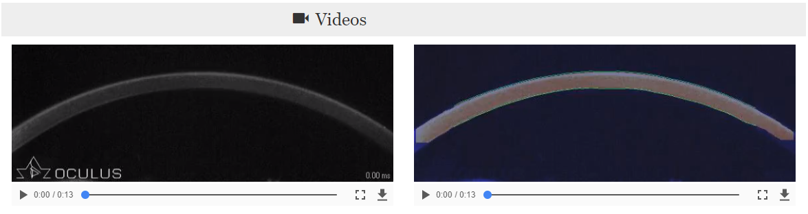
    
    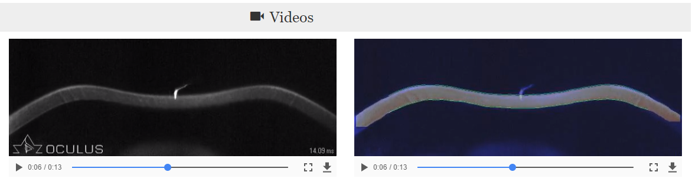
    
    Quickly inspect the detecting result. 

+ Frames

    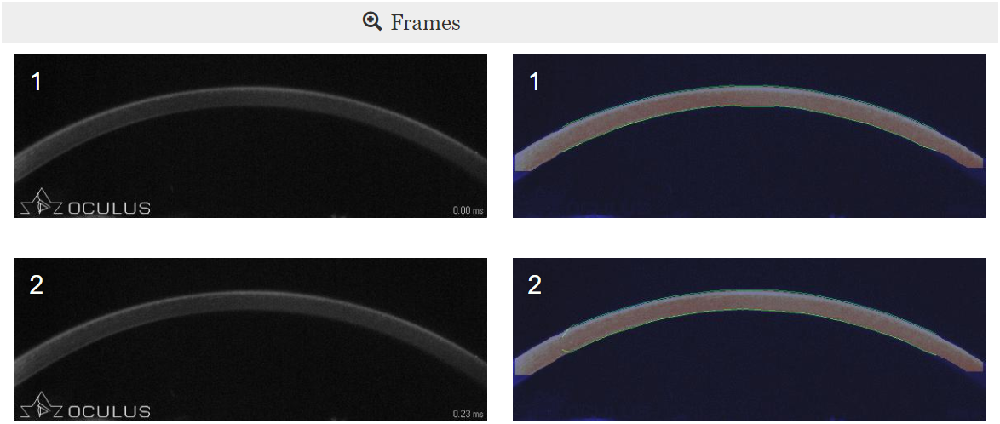
    
    
    
    
## Tips

+ Upload file limit is 12 files or 200MB
+ **BETTER** to `Refresh` the page after uploading 
+ `Clear` the *Repository* after inspection
    
    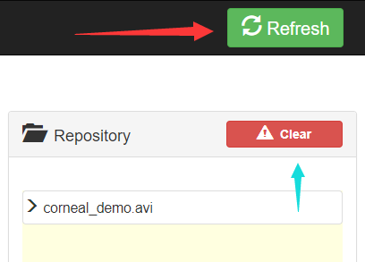
    
+ Use browser `search (^ + F)` when tend to locate a specific frame promptly
    
    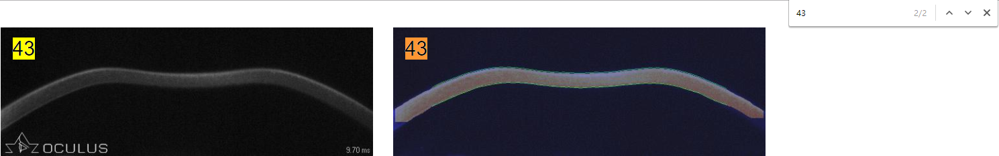
    
    
    
    
    
    
## Built With

* [PyTorch](http://pytorch.org/) - deep learning framework
* [CUDA](https://developer.nvidia.com/cuda-downloads) - GPU acceleration
* [U-Net](https://arxiv.org/abs/1505.04597) - neural net  
* [Flask](http://flask.pocoo.org/) - web framework 
* [Bootstrap](https://getbootstrap.com/) - front-end component library
* [ECharts](http://echarts.baidu.com/index.html) - visualization of charts

## Authors

* **Zeng Yu** - [Homepage](https://github.com/zengyu714)

## License

This project is licensed under the [Apache](https://choosealicense.com/licenses/apache-2.0/) License 

## Acknowledgments

+ If you want to train the dataset from the beginning, see this [repository](https://github.com/zengyu714/corneal-limbus-detection).
+ Recommend [Anaconda](https://www.anaconda.com/download/) to create envs and manage python packages.
+ I am verrrrry excited to release my first true, complete project. :kissing_heart: :kissing_heart:
